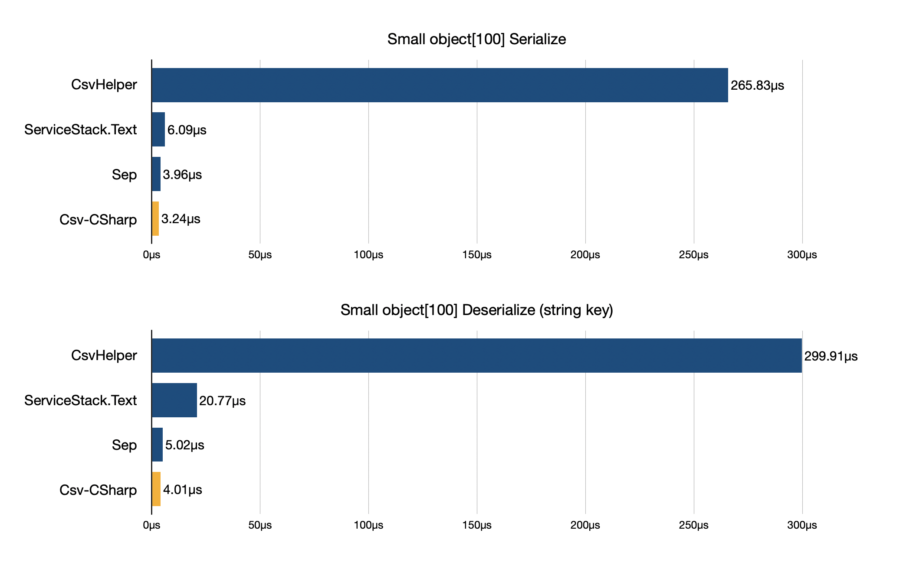

# Csv-CSharp

[](https://www.nuget.org/packages/CsvCSharp)
[](https://github.com/nuskey8/Csv-CSharp/releases)
[](./LICENSE)

English | [日本語](./README_JA.md)



Csv-CSharp is a highly performant CSV (TSV) parser for .NET and Unity. It is designed to parse UTF-8 byte arrays directly and leverage Source Generators to enable serialization and deserialization between CSV (TSV) and object arrays with zero (or very low) allocation.

## Installation

### NuGet packages

Csv-CSharp requires .NET Standard 2.1 or higher. The package can be obtained from NuGet.

### .NET CLI

```ps1
dotnet add package CsvCSharp
```

### Package Manager

```ps1
Install-Package CsvCSharp
```

### Unity

You can install Csv-CSharp in Unity using [NuGetForUnity](https://github.com/GlitchEnzo/NuGetForUnity). For details, refer to the NuGetForUnity README.

## Quick Start

Csv-CSharp serializes and deserializes CSV data to and from arrays of classes or structs.

Define a class or struct and add the `[CsvObject]` attribute and the `partial` keyword.

```cs
[CsvObject]
public partial class Person
{
    [Column(0)]
    public string Name { get; set; }

    [Column(1)]
    public int Age { get; set; }
}
```

All public fields and properties of a type marked with `[CsvObject]` must have either the `[Column]` or `[IgnoreMember]` attribute. (An analyzer will report a compile error if it does not find either attribute on public members.)

The `[Column]` attribute can specify a column index as an `int` or a header name as a `string`.

To serialize this type to CSV or deserialize it from CSV, use `CsvSerializer`.

```cs
var array = new Person[]
{
    new() { Name = "Alice", Age = 18 },
    new() { Name = "Bob", Age = 23 },
    new() { Name = "Carol", Age = 31 },
};

// Person[] -> CSV (UTF-8)
byte[] csv = CsvSerializer.Serialize(array);

// Person[] -> CSV (UTF-16)
string csvText = CsvSerializer.SerializeToString(array);

// CSV (UTF-8) -> Person[]
array = CsvSerializer.Deserialize<Person>(csv);

// CSV (UTF-16) -> Person[]
array = CsvSerializer.Deserialize<Person>(csvText);
```

`Serialize` has an overload that returns a UTF-8 encoded `byte[]`, and you can also pass a `Stream` or `IBufferWriter<byte>` for writing. `Deserialize` accepts UTF-8 byte arrays as `byte[]` and also supports `string`, `Stream`, and `ReadOnlySequence<byte>`.

The default supported types for fields and properties are `sbyte`, `byte`, `short`, `ushort`, `int`, `uint`, `long`, `ulong`, `char`, `string`, `Enum`, `Nullable<T>`, `DateTime`, `TimeSpan`, and `Guid`. To support other types, refer to the Extensions section.

## Serialization

The class or struct passed to `CsvSerializer` should have the `[CsvObject]` attribute and the `partial` keyword.

Only members with the `[Column]` attribute are serialized and deserialized. Public members must have either `[Column]` or `[IgnoreMember]`; otherwise the analyzer reports a compile error. Private members are ignored by default, but you can include them by adding `[Column]`.

```cs
[CsvObject]
public partial class Person
{
    [Column(0)]
    public string Name { get; set; } // serialized (public, must have [Column])

    [Column(1)]
    int age; // serialized (private, opted in with [Column])

    [IgnoreMember]
    public int Age => age; // not serialized (ignored via [IgnoreMember])
}
```

To specify header names instead of indices, pass the header name as a string.

```cs
[CsvObject]
public partial class Person
{
    [Column("name")]
    public string Name { get; set; }

    [Column("age")]
    public int Age { get; set; }
}
```

To use member names as column names, specify `[CsvObject(keyAsPropertyName: true)]`. In this case, the `[Column]` attribute is not required.

```cs
[CsvObject(keyAsPropertyName: true)]
public partial class Person
{
    public string Name { get; set; }
    public int Age { get; set; }
}
```

## CsvDocument

If you need to directly parse CSV fields, you can use `CsvDocument`.

```cs
var array = new Person[]
{
    new() { Name = "Alice", Age = 18 },
    new() { Name = "Bob", Age = 23 },
    new() { Name = "Carol", Age = 31 },
};

byte[] csv = CsvSerializer.Serialize(array);

// CSV (UTF-8) -> CsvDocument
var document = CsvSerializer.ConvertToDocument(csv);

foreach (var row in document.Rows)
{
    var name = row["Name"].GetValue<string>();
    var age = row["Age"].GetValue<int>();
}
```

## Options

You can change CSV settings by passing `CsvOptions` to Serialize/Deserialize.

```cs
CsvSerializer.Serialize(array, new CsvOptions()
{
    HasHeader = true, // Include header row
    AllowComments = true, // Allow comments starting with '#'
    NewLine = NewLineType.LF, // Newline type
    Separator = SeparatorType.Comma, // Separator character
    QuoteMode = QuoteMode.Minimal, // Field quoting conditions (Minimal quotes only fields that contain characters requiring escaping)
    FormatterProvider = StandardFormatterProvider.Instance, // ICsvFormatterProvider to use
});
```

## CSV Specifications

The default settings of Csv-CSharp generally follow the specifications outlined in [RFC 4180](https://www.rfc-editor.org/rfc/rfc4180.html). However, for performance and practicality, there are a few intentional deviations from the specification.

- The default newline character is LF instead of CRLF.
- Records with a mismatch in the number of fields can be read without errors; missing fields will be set to their default values.

## Extensions

This library provides interfaces `ICsvFormatter<T>` and `ICsvFormatterProvider` to customize field serialization and deserialization.

Use `ICsvFormatter<T>` for custom type serialization and deserialization. Here is an example of implementing a formatter for a struct wrapping an `int`.

```cs
public struct Foo
{
    public int Value;

    public Foo(int value)
    {
        this.Value = value;
    }
}

public sealed class FooFormatter : ICsvFormatter<Foo>
{
    public Foo Deserialize(ref CsvReader reader)
    {
        var value = reader.ReadInt32();
        return new Foo(value);
    }

    public void Serialize(ref CsvWriter writer, Foo value)
    {
        writer.WriteInt32(value.Value);
    }
}
```

Next, implement a formatter provider to retrieve the formatter.

```cs
public class CustomFormatterProvider : ICsvFormatterProvider
{
    public static readonly ICsvFormatterProvider Instance = new CustomFormatterProvider();

    CustomFormatterProvider()
    {
    }

    static CustomFormatterProvider()
    {
        FormatterCache<Foo>.Formatter = new FooFormatter();
    }

    public ICsvFormatter<T>? GetFormatter<T>()
    {
        return FormatterCache<T>.Formatter;
    }

    static class FormatterCache<T>
    {
        public static readonly ICsvFormatter<T> Formatter;
    }
}
```

The `CustomFormatterProvider` above only supports the `Foo` struct. To handle the default supported types as well, combine it with `StandardFormatterProvider` using `CompositeFormatterProvider`, and pass the result via `CsvOptions`.

```cs
// Create a composite formatter provider to combine multiple formatter providers
var provider = CompositeFormatterProvider.Create(
    CustomFormatterProvider.Instance,
    StandardFormatterProvider.Instance
);

CsvSerializer.Serialize(array, new CsvOptions()
{
    FormatterProvider = provider
});
```

## License

This library is released under the MIT license.